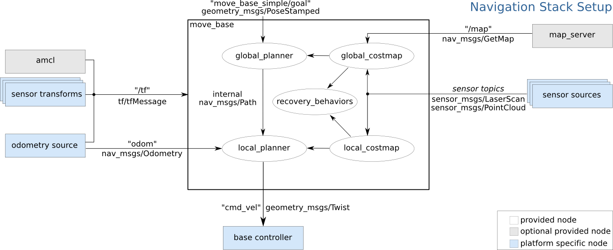
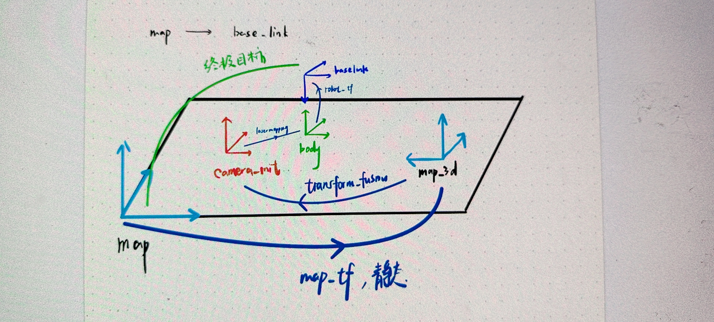
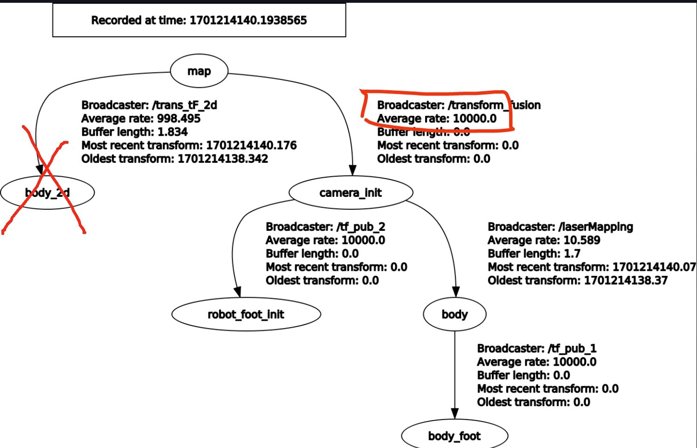

# Navigation

Navigation Stack 配置教程

> Reference: [Setup and Configuration of the Navigation Stack on a Robot](https://wiki.ros.org/navigation/Tutorials/RobotSetup)



## sentry_nav 目录结构

```text

```
## TF 树

### 最终坐标系转换情况





- `/transform_fusion`: 在 FAST_LIO_LOCALIZATION 的 launch 文件中被运行的节点，这个节点位于 FAST_LIO_LOCALIZATION/scripts 中
- `/tf_pub_1 /tf_pub_2 /tf_pub_3` 静态 TF，mapping and/or localize 时需要在 launch 文件中手动发布
    - `/tf_pub_1` 雷达 body 到机器人足端 body_foot 的静态映射

    ```xml
    <node pkg="tf2_ros" type="static_transform_publisher" name="tf_pub_1" args="-0.10 -0.11 0 0 0 0 body body_foot" />
    ```

    - `/tf_pub_2` 雷达初始位置 camera_init 到机器人足端初始位置body_init的静态映射

    ```xml
    <node pkg="tf2_ros" type="static_transform_publisher" name="tf_pub_2" args="-0.10 -0.11 0 0 0 0 camera_init robot_foot_init" />
    ```
    - `tf_pub_3` 雷达初始位置 camera_init 到 map 的静态映射,
    ```xml
    <node pkg="tf2_ros" type="static_transform_publisher" name="tf_pub_3" args="0 0 0 0 0 0 map camera_init" />
    ```
> `static_transform_publisher` 的用法: 参数顺序为 x y z yaw pitch roll fram_id child_frame_id.

Eg.
```
<node pkg="tf2_ros" type="statci_transform_publisher" name="xxx" args="x y z yaw pitch roll frame_id child_frame_id" >
```
## 彩虹楼点云图 

- 角点坐标：
 $(-0.6, 0.8), (-1, -4.6), (4.1, -4.7), (4.5, 0.5)$
- 理想地图的角点坐标
 $(0,0), (0,5), (5,5), (5,0)$

### 坐标变换 map_to_realWorld

SVD 分解
